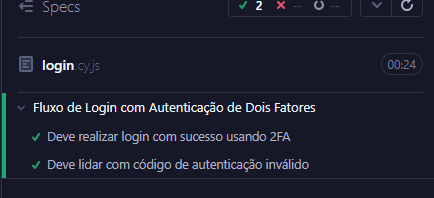

# Olá! 👋 Seja muito bem vindo ao meu Desafio Técnico - Coco Bambu | CBLab - Para uma posição de QA Engineer

Este documento detalha a execução das etapas 1, 2 e 3 do desafio técnico, com foco em **análise de fluxos críticos**, **automação de testes UI com Cypress** e **automação de testes de API com Cypress**.

---

## 📌 Etapa 1: Identificação de Fluxos Críticos

Nesta etapa foi realizada a análise funcional da plataforma de delivery:  
🔗 [https://app-hom.cocobambu.com/delivery](https://app-hom.cocobambu.com/delivery)

### 🔍 Fluxos selecionados e justificativas

---

### 1. Selecionar restaurante/região

- **Motivo**: Primeira interação do usuário após o login. Sem ela, o usuário não inicia a jornada de compra.
- **Impacto**: Crítico
- **Testes sugeridos**: Integração, funcional, usabilidade, regressão

**Cenário em Gherkin**:

```gherkin
Funcionalidade: Seleção de restaurante
  Como um usuário logado
  Quero selecionar uma região e restaurante
  Para que eu possa visualizar o cardápio e iniciar meu pedido

  Cenário: Selecionar uma região e restaurante com sucesso
    Given que estou na tela de seleção de região
    When eu seleciono "Brasília"
    Then devo visualizar o cardápio disponível
    And devo visualizar os produtos
```

---

### 2. Adicionar ao carrinho

- **Motivo**: Entrada no funil de compra. Sem isso, não há pedido.
- **Impacto**: Crítico
- **Testes sugeridos**: Funcional, integração

**Cenário em Gherkin**:

```gherkin
Funcionalidade: Adição de item ao carrinho
  Como um cliente
  Quero adicionar um produto ao meu carrinho
  Para que eu possa comprá-lo posteriormente

  Cenário: Adicionar um item com sucesso
    Given que estou na página de produtos com o usuário logado e seleciono um produto
    When eu clico em "ADICIONAR" no produto "Camarão Coco Bambu (Meio)"
    Then devo visualizar o produto na sacola
```

---

### 3. Efetuar a compra

- **Motivo**: Etapa final. Se falhar, frustração total e perda de receita.
- **Impacto**: Crítico
- **Testes sugeridos**: Funcional, integração, regressão, E2E

**Cenário em Gherkin**:

```gherkin
Funcionalidade: Finalização de pedido
  Como um cliente com itens no carrinho e endereço cadastrado
  Quero finalizar minha compra
  Para que eu possa receber meu pedido

  Cenário: Finalizar pedido com sucesso
    Dado que tenho itens no carrinho e um endereço válido selecionado
    Quando eu clico em "Finalizar pedido"
    Então devo ver a confirmação de pedido com número e estimativa de entrega
```

---

### 4. Cadastrar endereço

- **Motivo**: Obrigatório para checkout. Também impacta na retenção do cliente.
- **Impacto**: Crítico
- **Testes sugeridos**: Funcional, integração, validação de campos, usabilidade

**Cenário em Gherkin**:

```gherkin
Funcionalidade: Cadastro de endereço
  Como um cliente
  Quero cadastrar um novo endereço
  Para que eu possa receber o pedido em local desejado

  Cenário: Cadastrar endereço válido com sucesso
    Given que estou logado no sistema
    When acesso a aba Perfil e cadastro um novo endereço válido na região "Brasília"
    Then o novo endereço deve aparecer listado em Meus endereços
```

---

### 5. Remover item do carrinho

- **Motivo**: Impacta na experiência e controle do pedido.
- **Impacto**: Alto
- **Testes sugeridos**: Funcional, integração, estado

**Cenário em Gherkin**:

```gherkin
Funcionalidade: Remoção de item do carrinho
  Como um cliente
  Quero remover produtos do meu carrinho
  Para que eu possa ajustar meu pedido antes de finalizar

  Cenário: Remover item com sucesso
    Dado que tenho o item "Camarão Internacional" no meu carrinho
    Quando eu clico em "Remover"
    Então o item deve desaparecer do carrinho
    E o valor total deve ser atualizado corretamente
```

---

## 🧪 Etapa 2: Automação de UI com Cypress

### ✔️ Fluxos automatizados:

- Login (via sessão) - `login.cy.js`
  
- Selecionar restaurante e ver produtos - `accessMenu.cy.js`
  
- Adicionar item ao carrinho - `addItemToCart.cy.js`
  
- Cadastro de novo endereço - `adressRegister.cy.js`
  

### 🧱 Arquitetura utilizada:

```
cypress/
├── e2e/
│   ├── login.cy.js
│   ├── accessMenu.cy.js
│   ├── addItemToCart.cy.js
│   ├── adressRegister.cy.js
│   └── flows/                  # testes Gherkin (documentação comportamental)
├── support/
│   ├── page_objects/           # Page Object model
│   ├── commands.js             # login por sessão
│   └── e2e.js
├── fixtures/
│   └── userData.json           # credenciais de teste
```

---

## ▶️ Como executar os testes UI

1. Instale dependências:

```bash
npm install
```

2. Execute os testes:

```bash
npx cypress run --e2e
```

Ou abra a interface gráfica:

```bash
npx cypress open
```

---

## ✅ Diferenciais implementados

- Utilização de **Page Objects**
- Separação de testes em arquivos específicos por funcionalidade
- Login rápido com **sessão persistida**
- Testes escritos também em **formato BDD (Gherkin)** para facilitar entendimento por stakeholders
- Boa prática de estrutura modular

---

## 🚗 Etapa 3: Automação de testes de API com Cypress

## ✅ Objetivo

Automatizar e validar as rotas de API relacionadas ao carrinho de compras da [API DummyJSON](https://dummyjson.com):

- Adicionar item ao carrinho
- Atualizar carrinho
- Remover carrinho

---

## 🧱 Tecnologias e Ferramentas

- [Cypress](https://www.cypress.io/) 14.x
- JavaScript (ES6)
- Estrutura Page Object para requests (`support/requests`)
- Comandos customizados com `Cypress.Commands.add()`

---

## 🧩 Estrutura de Pastas

```
cypress/
├── e2e/
│   └── api/
│       └── cartAPI.cy.js          # Arquivo principal de testes
├── support/
│   ├── requests/
│   │   └── cartRequests.js        # Requisições encapsuladas
│   └── commands.js                # Comandos reutilizáveis Cypress
```

---

## 📘 Documentação da API usada

- [Adicionar ao carrinho](https://dummyjson.com/docs/carts#carts-add)
- [Atualizar carrinho](https://dummyjson.com/docs/carts#carts-update)
- [Remover carrinho](https://dummyjson.com/docs/carts#carts-delete)

---

## 🧪 Comandos customizados criados

Local: `cypress/support/commands.js`

```js
Cypress.Commands.add("addToCart", (payload) => {
  return CartRequests.addToCart(payload);
});

Cypress.Commands.add("updateCart", (cartId, payload) => {
  return CartRequests.updateCart(cartId, payload);
});

Cypress.Commands.add("deleteCart", (cartId) => {
  return CartRequests.deleteCart(cartId);
});
```

---

## 🎯 Técnicas de Teste Aplicadas

| Técnica                         | Aplicação                                                                      |
| ------------------------------- | ------------------------------------------------------------------------------ |
| Particionamento de Equivalência | Testes com payloads válidos e inválidos                                        |
| Análise de Valor Limite         | Ex: Atualizar com quantidade 0 ou limite alto                                  |
| Teste de Status Code            | Verificação de respostas HTTP 200, 201, 400, 404                               |
| Teste de Contrato               | Validação da estrutura dos dados esperados na resposta (como `id`, `products`) |
| Teste Negativo                  | Verificação de resposta ao enviar payloads inválidos                           |

---

## 📄 Testes Implementados

### ➕ Adicionar ao Carrinho

- ✅ Adicionar múltiplos itens com sucesso
- ❌ Tentar adicionar com payload vazio (esperado falhar)

### 🔁 Atualizar Carrinho

- ✅ Atualizar quantidade de produto em carrinho existente (`/carts/1`)
- ❌ Atualizar carrinho inexistente (`/carts/9999`)

### 🗑 Remover Carrinho

- ✅ Remover carrinho com ID existente (`/carts/1`)
- ❌ Tentar remover carrinho inexistente (`/carts/999999`)

---

## ⚠️ Observações sobre a API DummyJSON

- O endpoint `POST /carts/add` **retorna `201` com um carrinho simulado**, mas **não persiste o carrinho**
- Portanto, o ID retornado pelo `add` **não pode ser usado** diretamente nos testes de `update` e `delete`
- Para `PUT` e `DELETE`, **utilizamos IDs de carrinhos pré-existentes (1 a 20)**

---

## ▶️ Como executar os testes

1. Instale as dependências:

```bash
npm install
```

2. Execute os testes de API:

```bash
npx cypress run --spec "cypress/e2e/api/cartAPI.cy.js"
```

Ou abra o modo interativo:

```bash
npx cypress open
```

---

## 🙌 Conclusão do desafio

A execução deste desafio proporcionou uma experiência prática completa, desde a análise crítica de fluxos funcionais, passando pela automação da interface web com boas práticas, até a validação robusta de APIs REST.

Durante o processo, pude aplicar técnicas essenciais de QA como:

Particionamento de equivalência

Testes de valor-limite

Validação de status e contrato de API

Automação com Page Object Model e testes BDD

Além disso, utilizei ferramentas modernas como Cypress, Gherkin, comandos reutilizáveis e estrutura modular para garantir clareza, reutilização e escalabilidade nos testes.

O desafio reforçou a importância de enxergar o produto não apenas do ponto de vista técnico, mas também da jornada real do usuário, focando na prevenção de falhas críticas e na entrega de valor.

Essa foi uma excelente oportunidade de demonstrar habilidades práticas de QA, pensamento analítico e organização em um cenário realista.
